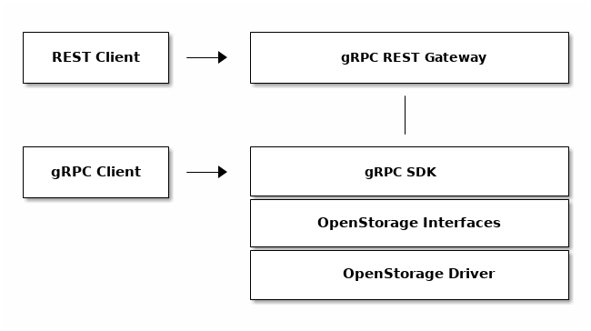

# Architecture

## Overview
The software development kit for OpenStorage is based on [gRPC](https://grpc.io/),
allowing clients to be automatically generated in multiple languages.

Different OpenStorage drivers may run the OpenStorage gRPC server on different
locations. Please, refer to your deployed driver documentation for instructions
on how to setup a connection to the gRPC server.

In this document, examples will refer to both the [OpenStorage SDK Mock](installing.md)
and Portworx drivers.

OpenStorage API calls are ment to be idempotent to ensure consistency across calls, unless
otherwise specified.

## Protocol Buffers gRPC Source File
The gRPC bindings are created from [`api/api.proto`](https://github.com/libopenstorage/openstorage/blob/master/api/api.proto) file
available in the OpenStorage github repo.

## Error Handling
All API calls use the [standard gRPC status](https://github.com/grpc/grpc/blob/master/src/proto/grpc/status/status.proto).
